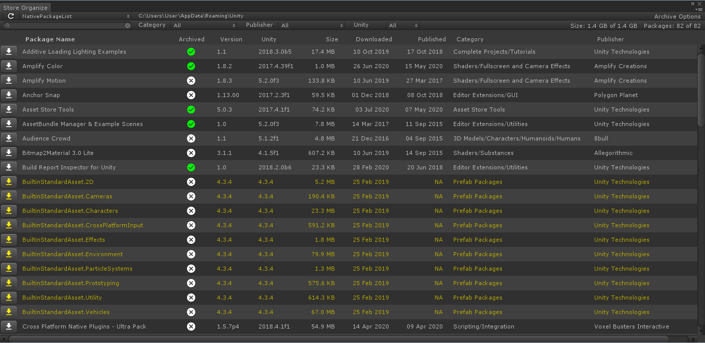

## Unity - Asset Store Organizer

A Unity Editor Tool that allows you to quickly import or embed Unity Asset Store Packages into your project with additional support to allow archiving of packages to a different drive or folder and easily move or delete packages between them.

### Introduction
After years of frustration using the Unity Asset Store and even the new Package Manager when they added Asset Store support I decided to write my own Unity editor tool to solve several of my biggest complaints.

1. Choose where to install Asset Store Packages.
2. Poor support for quickly finding a purchased Asset Store Package and installing it.

### Important
**This tool does not allow you to change the default download location of Asset Store instead it offers an archiving mechansim as a way to mitigate this issue.**

**It should be noted that currently there is no good mechnsim for checking if the current version of a package is the latest one. Therefore you should always do that via the Asset Store or the Package Manager if it is important.**

## Key Features
Key features of the tool:

* Archive packages to a new folder or drive.
* Archiving maintains a copy of all versions of the package.
* Import or Embed directly from Archive location.
* Import any version of a package from your archive directly.
* Search function to quickly find asset by name.
* Filter functions to reduce the displayed list of assets by Category, Publisher or Unity version.
* Stats showing total disk space used and number of packages by location.

### Archiving
Straightforward archiving system that allows you to quickly and simply archive packages and then import them directly from that location into an Unity project. Alternatively you can use the archiving mechanism to move packages back and forth between the official Unity Asset Store download location and your archive location. This is useful for when you want to check if a package has an update available.

Furthermore archiving will actually keep package versions separate, allowing you to keep and maintain older versions of a package on disk. You can then choose which version to install from the archive.

### Performance
Apart from an initial delay the first time you open the editor in Unity, the editor tool provides a fast and easy method to quickly install or embed a package into your project.

### Search & Filters
The tool provides a fast dynamic search function and means to filter the results so you can quickly locate the desired Asset.

## Help

### Toolbar

**Refresh Button**
Use the refresh button to refresh the package list of the current package location.

**Package Source Locations**
You can choose the location of the packages you are browsing from the dropdown list. Regardless of browsing location you can import or embed packages from the browser by clicking on the import icon or clicking on the Package name and choosing from the dropdown menu.

Locations:

* NativePackageList - This returns all the packages found by Unity using its own native methods.
* AssetStore - This returns all packages found in the pre Unity 5.x Asset Store Location.
* AssetStore5x - This returns all the packages found in the post Unity 5.x Asset Store Location.
* Custom  - This is a secondary custom location you set up by clicking on the 'browse' or path name.
* Archive - This is a custom location you set up by clicking on the 'browse' or path name.

**Package Source Path Name**
This shows the current path name used as the source location. If it states 'Browse' then clicking it will open a folder dialog from which you can locate or create a new folder to use for custom or archive location.

**Archive Options**
This button displays a dropdown with the following options:

* Disable File Operations
Will disable actual archiving file operations as a tool for debugging.

* Archive Shown Packages
Click to archive all currently listed packages in the browser that are not currently archived or have a different version number to the ones that are.

* Log Store Paths
Debugging tool to show all the paths to the locations being used.

### Search Bar

**Search Box**
Type the name of the package/asset you want to search for. Dynamically searches the package location as you type to locate the asset quickly without having to type the exact or whole name of the asset.

**Filters - Category**
Dropdown list of all the categories used by the packages in the current location.
Selecting a filter will display only those packages in the browser.

**Filters - Publisher**
Dropdown list of all the publishers used by the packages in the current location.
Selecting a filter will display only those packages in the browser.

**Filters - Unity Version**
Dropdown list of all the Unity Versions used by the packages in the current location.
Selecting a filter will display only those packages in the browser.

**Stats**
Displays size of all packages listed vs size of all packages in location.
Displays count of all packages listed vs of all packages in location.

### Browser Window
The main window is the browser that lists all the currently valid packages from the chosen location, search and filters.

**Import Button**
Click this button to begin the package Import process.

**Package Name**
The name of the package. Click this area to access a dropdown menu:

* Import Package - begins the package Import process.
* Embed Package - copies the package into the project.
* Delete from AssetStore Cache - will delete the asset from this source location!
* Archive Package - Will archive the package.
	
* Show In Explorer - Will open an explorer window at the asset package location.
* Log Package Information - Useful debug information about the package.
* Log Archive Status - Will output to console window the status of the package if its been archived and what versions.

* Show Internet Browser
	* View Asset 
	Will open the Unity Asset Store page for this asset in your default Internet Browser.

	* View Publisher 
	Will open the Unity Asset Store page for this publisher in your default Internet Browser.

	* View Category
	Will open the Unity Asset Store page for this category of asset in your default Internet Browser.

* Show Asset Store Tab
	* View Asset 
	Will open the Unity Asset Store for this asset in an Editor tab.

	* View Publisher 
	Will open the Unity Asset Store page for this publisher in an Editor tab.

	* View Category
	Will open the Unity Asset Store page for this category of asset in an Editor tab.

## Updates
*2023.04.20 () - Updated NoiseCrimeStudios Core Namespaces to match current projects.

* 2023.04.20 (430d1eb) - Updated EditorConfig to match the standard I'm using for all current and future projects. Resulted in a large amount of changes to files, but limited to things like addressing Name Rule violations, layout, explicit 'private' of methods and line endings.

* 2023.04.13 (3bc2d9c) - Version 1.1: Fixed issues with light/dark skin UI.

* 2021.03.23 (14a7d93) - Version 1.0

## Forum Page
	TBD

## System Requirements
Unity 5.6.7f1+

## License

[MIT](LICENSE.md)
